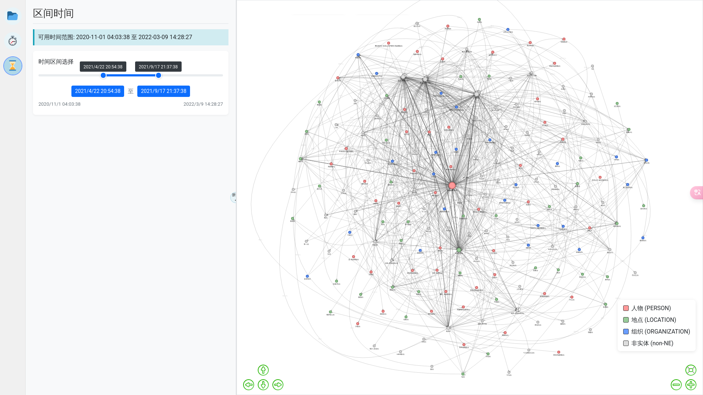

# LMZ：中文叙事图谱

## 环境配置

### 方法 1: 使用提供的环境文件（推荐）

```bash
# 创建环境
conda env create -f narrative-map-environment.yml

# 激活环境
conda activate narrative-map
```



## 开发阶段使用的预训练模型

分句：spacy.load("zh_core_web_sm")

SRL、NER：hanlp.pretrained.mtl.CLOSE_TOK_POS_NER_SRL_DEP_SDP_CON_ELECTRA_BASE_ZH（ https://hanlp.hankcs.com/docs/api/hanlp/pretrained/mtl.html ）

word2vec：sgns.weibo.word（ https://github.com/Embedding/Chinese-Word-Vectors ）

情感分析：hw2942/bert-base-chinese-finetuning-financial-news-sentiment-v2（ https://huggingface.co/hw2942/bert-base-chinese-finetuning-financial-news-sentiment-v2 ）

## 近期已完成工作

2025.4.5：

1. [X] 项目结构优化
2. [X] 支持多种格式的（txt、csv、xlsx）作为输入
3. [X] 两个节点之间支持多种动作连边
4. [X] 优化了部分冗余代码
5. [X] 搜集了937条新闻报道数据（人民网-“泽连斯基”相关的搜索结果）
6. [X] 增加了sentiment情感分析拓展模块

2025.4.18：

1. [X] 增加了UMAP+HDBSCAN组合的非实体词降维功能，同时K-means超参K值也支持自动计算（但大量数据计算轮廓系数效率很低，不推荐！！！）
2. [X] 支持更高级自定义过滤功能（自定义节点名称、自定义剔除节点、筛选特定频率的三元组）
3. [X] 网络节点颜色支持自定义，支持显示两个节点之间的多种关系，优化了连边粗细，展示更加美观
4. [X] 获取了一批新的真实测试数据

## 下一阶重点段任务
1. ⚪叙事网络UI加入时间序列呈现模块（理想效果是在前台时序轴上自定义筛选特定阶段的叙事）
2. ⚪HanLP官方提供的的SRL预训练模型效果实在一般，考虑自己训练一个基于BERT的SRL模型（参考：https://github.com/jiangnanboy/albert_srl ）
3. ⚪尝试加入指代消解功能（根据实际经验来说很重要）
4. ⚪实际经验中发现了二级SRL的问题，比如“我认为他就是一个精神病人”，SRL所得：[我：施事者, 认为：谓词, 他就是一个精神病人：受事者]，但就叙事分析来说，明显“他就是一个精神病人”更有分析价值，大部分的SRL无法解决此类问题，得想办法克服这个问题。
5. ⚪优化代码细节，再次优化项目结构，为预发布作准备
6. ⚪簇标签提取逻辑可以再优化一下


## 参考文献：

[1]Ash E, Gauthier G, Widmer P. Relatio: Text semantics capture political and economic narratives[J]. Political Analysis, 2024, 32(1): 115-132.

[2]孔杉杉,张军,冯立超.基于计算叙事模型的虚假健康信息特征研究[J].情报杂志,2024,43(02):152-161.

[3]杨萍,张军,李鹏.计算叙事视角下健康类辟谣文本回应特征研究[J/OL].复杂系统与复杂性科学,1-7[2025-03-07].http://kns.cnki.net/kcms/detail/37.1402.N.20241122.1355.009.html.