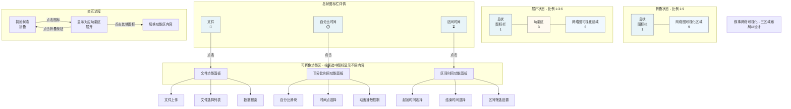

```mermaid
graph TD
    A[叙事网络可视化 - 三区域布局UI设计]

    subgraph 折叠状态[折叠状态 - 比例 1:9]
        B1[岛状<br>图标栏<br>1] --- C1[网络图可视化区域<br>9]
    end

    subgraph 展开状态[展开状态 - 比例 1:3:6]
        B2[岛状<br>图标栏<br>1] --- D[功能区<br>3] --- C2[网络图可视化区域<br>6]
    end

    subgraph 图标布局[岛状图标栏详情]
        I1[文件<br>📂]
        I2[百分比时间<br>⏱️]
        I3[区间时间<br>⌛]
    end

    subgraph 功能区内容[可折叠功能区 - 根据选中图标显示不同内容]
        F1[文件功能面板]
        F2[百分比时间功能面板]
        F3[区间时间功能面板]
    end

    I1 -- 点击 --> F1
    I2 -- 点击 --> F2
    I3 -- 点击 --> F3

    F1 --> F1a[文件上传]
    F1 --> F1b[文件选择列表]
    F1 --> F1c[数据预览]

    F2 --> F2a[百分比滑块]
    F2 --> F2b[时间点选择]
    F2 --> F2c[动画播放控制]

    F3 --> F3a[起始时间选择]
    F3 --> F3b[结束时间选择]
    F3 --> F3c[区间筛选设置]

    subgraph 交互流程
        S1[初始状态<br>折叠] --> |点击图标| S2[显示对应功能区<br>展开]
        S2 --> |点击折叠按钮| S1
        S2 --> |点击其他图标| S3[切换功能区内容]
    end

    style B1 fill:#e8f4f8,stroke:#666,stroke-width:1px
    style B2 fill:#e8f4f8,stroke:#666,stroke-width:1px
    style C1 fill:#f0f8ff,stroke:#666,stroke-width:1px
    style C2 fill:#f0f8ff,stroke:#666,stroke-width:1px
    style D fill:#fffaf0,stroke:#666,stroke-width:1px

    style I1 fill:#e8f4f8,stroke:#666,stroke-width:1px,radius:50%
    style I2 fill:#e8f4f8,stroke:#666,stroke-width:1px,radius:50%
    style I3 fill:#e8f4f8,stroke:#666,stroke-width:1px,radius:50%

    classDef iconStyle fill:#e8f4f8,stroke:#666,stroke-width:1px,radius:50%
    class I1,I2,I3 iconStyle
```
